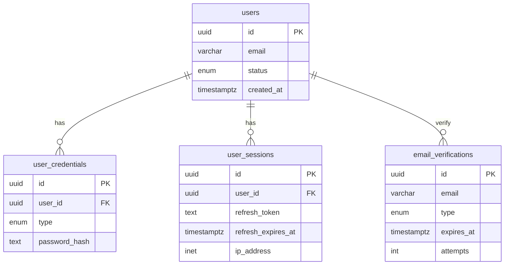

# Node Express Boilerplate

一个基于 **Express 5 + TypeScript (ESM)** 的快速启动模板，内置 Prisma + PostgreSQL、完善的安全中间件、结构化日志与参数校验，开箱即用支持本地开发与 Docker 部署。

## 技术栈与特性

- **运行时**：Node.js 20、TypeScript ESM（`"type": "module"`，`moduleResolution: NodeNext`）
- **Web 框架**：Express 5，分层目录（路由/控制器/服务/中间件/Schema）
- **数据库**：PostgreSQL + Prisma ORM（生成客户端于 `generated/prisma`）
- **校验与安全**：Zod 参数校验、Helmet 安全头、CORS 自定义策略、速率限制（通用/严格）、请求体大小限制
- **日志**：pino / pino-http，按日写入 `logs/`，自动 request-id，健康检查静默
- **构建与工具链**：tsup 构建、tsx 热重载、ESLint + Prettier、husky + lint-staged
- **部署**：Dockerfile + docker-compose（dev/prod profiles），启动时执行迁移

## 环境要求

- Node.js 20+
- pnpm（建议开启 corepack）
- Docker（用于本地数据库或容器化部署）

## 快速开始（本地开发）

1. 克隆与安装

```bash
git clone <repository-url>
cd node-express-boilerplate
pnpm install --frozen-lockfile
```

2. 准备环境变量：创建 `.env`（见下方示例），确保数据库与 JWT 配置完整
3. 启动数据库（dev profile 仅包含 Postgres）

```bash
docker compose --profile dev up -d
```

4. 初始化数据库（无需 `prisma init`，已提供迁移）

```bash
pnpm prisma migrate dev
```

- 应用全部迁移并生成 Prisma Client

5. 启动开发服务器（监听 `.ts`）

```bash
pnpm dev
```

## 环境变量说明

> 所有应用层变量由 `src/config/env.schema.ts` 校验，缺失或格式错误会直接抛出异常；容器级变量影响 docker-compose / Nginx / Postgres 行为。

应用运行时变量（Node 容器内生效）：

| 变量                          | 说明                                  | 默认值/示例             |
| ----------------------------- | ------------------------------------- | ----------------------- |
| `NODE_ENV`                    | `development` / `production` / `test` | `development`           |
| `API_PORT`                    | 应用监听端口（容器内）                | `8090`                  |
| `API_PREFIX`                  | 路由前缀                              | `/api`                  |
| `POSTGRES_HOST`               | 数据库主机                            | 必填                    |
| `POSTGRES_PORT`               | 数据库端口                            | `5432`                  |
| `POSTGRES_DB`                 | 数据库名                              | 必填                    |
| `POSTGRES_APP_USER`           | 应用数据库用户                        | 必填                    |
| `POSTGRES_APP_PASSWORD`       | 应用数据库密码                        | 必填                    |
| `JWT_SECRET`                  | 访问令牌密钥（≥32 字符）              | 必填                    |
| `JWT_EXPIRES_IN`              | 访问令牌过期时间                      | `7d`                    |
| `JWT_REFRESH_SECRET`          | 刷新令牌密钥（≥32 字符）              | 必填                    |
| `JWT_REFRESH_EXPIRES_IN`      | 刷新令牌过期时间                      | `30d`                   |
| `REDIS_URL`                   | 可选 Redis 连接                       | 可选                    |
| `SMTP_HOST`                   | SMTP 主机                             | `smtp.example.com`      |
| `SMTP_PORT`                   | SMTP 端口                             | `587`                   |
| `SMTP_SECURE`                 | 是否使用 TLS（`true`/`false`）        | `false`                 |
| `SMTP_USER` / `SMTP_PASSWORD` | SMTP 账号/密码                        | 占位：`<secret>`        |
| `SMTP_FROM`                   | 发信人邮箱                            | `no-reply@example.com`  |
| `UPLOAD_BASE_URL`             | 对外访问上传文件的基础 URL            | `http://localhost`      |
| `UPLOAD_MAX_SIZE`             | 单文件大小（MB）                      | `10`                    |
| `UPLOAD_MAX_FILES`            | 多文件上传最大文件数                  | `10`                    |
| `UPLOAD_DIR`                  | 容器内上传目录名                      | `uploads`               |
| `UPLOAD_ALLOWED_MIME_TYPES`   | 允许的 MIME 列表（逗号分隔）          | 见 `env.schema.ts` 默认 |
| `CORS_ORIGIN`                 | `*` 或逗号分隔的允许来源 URL 列表     | `*`                     |

容器/基础设施相关变量（主要由 `docker-compose.yml` / Nginx 使用）：

| 变量                      | 说明                                   | 默认值/示例     |
| ------------------------- | -------------------------------------- | --------------- |
| `API_UPSTREAM_HOST`       | Nginx 反代上游主机名（compose 内部）   | `app`           |
| `API_UPSTREAM_PORT`       | 上游应用端口（与 `API_PORT` 保持一致） | `8090`          |
| `NGINX_PORT`              | 宿主机暴露的 Nginx 端口                | `80`            |
| `POSTGRES_OWNER_USER`     | 数据库超级用户（用于初始化与授权）     | `postgres`      |
| `POSTGRES_OWNER_PASSWORD` | 超级用户密码（仅在 db 容器启动时使用） | `<secret>`      |
| `POSTGRES_TIMEZONE`       | 数据库默认时区                         | `Asia/Shanghai` |
| `UPLOAD_DIR`              | 上传目录名（与 Node 环境保持一致）     | `uploads`       |

`.env` 示例（请替换敏感值）：

```env
NODE_ENV=development
API_PORT=8090
API_PREFIX=/api

POSTGRES_HOST=localhost
POSTGRES_PORT=5432
POSTGRES_DB=node_express_boilerplate
POSTGRES_APP_USER=app
POSTGRES_APP_PASSWORD=app

JWT_SECRET=abcdefghijklmnopqrstuvwxyz123456
JWT_EXPIRES_IN=7d
JWT_REFRESH_SECRET=abcdefghijklmnopqrstuvwxyz123456
JWT_REFRESH_EXPIRES_IN=30d

REDIS_URL=

SMTP_HOST=smtp.example.com
SMTP_PORT=587
SMTP_SECURE=false
SMTP_USER=smtp-user
SMTP_PASSWORD=smtp-password
SMTP_FROM=no-reply@example.com

UPLOAD_BASE_URL=http://localhost
UPLOAD_MAX_SIZE=10
UPLOAD_MAX_FILES=10
UPLOAD_DIR=uploads
UPLOAD_ALLOWED_MIME_TYPES=image/jpeg,image/png

CORS_ORIGIN=http://localhost:3000

# 容器/反代可选覆盖
API_UPSTREAM_PORT=8090
API_UPSTREAM_HOST=app
NGINX_PORT=80
POSTGRES_OWNER_USER=postgres
POSTGRES_OWNER_PASSWORD=postgres
POSTGRES_TIMEZONE=Asia/Shanghai
```

## 容器与宿主映射关系

| Profile | 服务        | 宿主端口 → 容器端口                | 卷挂载                                                                                                                                                                 | 说明                                                   |
| ------- | ----------- | ---------------------------------- | ---------------------------------------------------------------------------------------------------------------------------------------------------------------------- | ------------------------------------------------------ |
| dev     | `db`        | `${POSTGRES_PORT}:5432`            | `postgres_data:/var/lib/postgresql/data`<br>`./db/init:/docker-entrypoint-initdb.d`                                                                                    | 仅数据库，供本地开发使用                               |
| dev     | `nginx-dev` | `${NGINX_PORT:-80}:80`             | `./nginx/entrypoint.sh:/entrypoint.sh:ro`<br>`./nginx/default.conf.template:/etc/nginx/templates/default.conf.template:ro`<br>`./uploads:/var/www/${UPLOAD_DIR}:ro`    | 反代/静态托管，本地直接挂载宿主 `./uploads` 只读       |
| prod    | `db`        | `${POSTGRES_PORT}:5432`            | 同上                                                                                                                                                                   | 生产/预发数据库，启动时会加载初始化脚本                |
| prod    | `app`       | `${API_PORT}:${API_UPSTREAM_PORT}` | `uploads_data:/app/${UPLOAD_DIR}`                                                                                                                                      | Node 应用容器，入口会执行 `pnpm prisma migrate deploy` |
| prod    | `nginx`     | `${NGINX_PORT:-80}:80`             | `./nginx/entrypoint.sh:/entrypoint.sh:ro`<br>`./nginx/default.conf.template:/etc/nginx/templates/default.conf.template:ro`<br>`uploads_data:/var/www/${UPLOAD_DIR}:ro` | 生产反代/静态托管，与 `app` 共享上传卷                 |

- `uploads_data`：跨 `app` 与 `nginx` 共享上传文件；dev 下改为宿主目录直挂载便于调试。
- Nginx 入口脚本 `nginx/entrypoint.sh` 会根据 `NODE_ENV` 选择是否保留 API 反代块，并通过 envsubst 替换模板变量。

## 目录结构速览

```
src/
  config/         # 环境加载与校验
  routes/         # 路由定义（health/auth）
  controllers/    # 控制器层
  services/       # 业务逻辑
  middlewares/    # 安全、日志、验证、错误处理
  schemas/        # Zod 校验 Schema
  database/       # Prisma 客户端初始化
  utils/          # 工具与响应封装
prisma/           # 数据模型与迁移
db/init/          # Postgres 初始化脚本（角色/权限）
logs/             # 按日落盘的 pino 日志
```

## 常用脚本

- `pnpm dev`：开发模式（`tsx watch src/server.ts`）
- `pnpm build`：使用 tsup 构建到 `dist/`
- `pnpm start`：运行编译产物 `dist/server.js`
- `pnpm lint` / `pnpm lint:fix`：ESLint 检查/修复
- `pnpm format` / `pnpm format:check`：Prettier 格式化/检查
- `pnpm prisma migrate dev`：开发迁移（含生成客户端）
- `pnpm prisma migrate deploy`：生产迁移（在容器入口脚本中调用）

## 数据库与 Prisma

- 模型与迁移位于 `prisma/`；生成客户端输出到 `generated/prisma`
- 本地迁移：`pnpm prisma migrate dev`
- 生产迁移：`pnpm prisma migrate deploy`（Docker 启动时会执行）
- 连接配置由 `src/config/index.ts` 组合 env 变量生成

### 表与关系概览

当前核心表（Prisma schema）：

- `users`：用户主体，`status` 枚举（ACTIVE/DISABLED/DELETED）。
- `user_credentials`：认证凭据，支持多种登录方式，当前使用 `PASSWORD`，唯一键 `(user_id, type)`。
- `user_sessions`：刷新令牌会话，记录 `refresh_token`、过期时间、UA、IP、吊销标记。
- `email_verifications`：邮件验证码，记录哈希、类型（REGISTER/RESET_PASSWORD）、过期与尝试次数。

关系示意：



### 业务流程概要

- 注册：`POST /auth/register` → 校验邮箱验证码 (`email_verifications`) → 创建用户与密码凭据。
- 登录：`POST /auth/login` → 校验密码 → 生成访问/刷新令牌，`refresh_token` 写入 `user_sessions` 与 HttpOnly Cookie。
- 刷新：`POST /auth/refreshToken` → 校验会话、过期与吊销状态 → 返回新访问令牌。
- 重置密码：`POST /auth/resetPassword` → 验证邮箱验证码 → 更新 `user_credentials.password_hash`。
- 邮件验证码：`GET /mail/code` → 频控（每 60s）→ 生成 6 位验证码，哈希入库并通过 SMTP 发送（5 分钟有效，最多 5 次错误尝试）。
- 上传：需要鉴权的受保护路由，Multer 写入 `${UPLOAD_DIR}`，生成可公共访问 URL `${UPLOAD_BASE_URL}/${UPLOAD_DIR}/{filename}`。

## API 摘要（默认前缀 `${API_PREFIX}`）

- 健康检查
  - `GET /health/live`：存活探针
  - `GET /health/ready`：就绪探针（会触发一次数据库可用性检查）
- 认证
  - `POST /auth/register`：`{ username, password, email, emailCode(6位), emialUuid(UUID) }`
  - `POST /auth/login`：`{ username, password }`
  - 两个接口均使用严格限流 `strictLimiter`（5 次/15 分钟，成功不计数）与 Zod 体校验
- 响应格式（成功）：`{ code, data, message }`；错误通过 `HttpError` 返回业务码与描述

## 安全与中间件

- `helmetMiddleware`：CSP/HSTS/Referrer-Policy 等，生产环境更严格
- `corsConfig`：支持通配或白名单，开发默认放行
- `apiLimiter` / `strictLimiter`：速率限制，按 IP + username 组合键
- 请求体限制：JSON/URL-Encoded 默认 10MB
- `httpLoggerMiddleware`：pino-http，自动 request-id，健康探针不记录
- `errorMiddleware`：区分业务错误（4xx）与系统错误（5xx），生产屏蔽堆栈

## 构建与部署

- 本地构建与运行
  ```bash
  pnpm build
  pnpm start
  ```
  需确保 `.env` 与数据库可用。
- Docker 单容器
  ```bash
  docker build -t node-express-boilerplate .
  docker run --env-file .env.docker -p 8090:8090 node-express-boilerplate
  ```
  入口脚本会执行 `pnpm prisma migrate deploy`，请保证数据库连通。
- docker-compose（含 Postgres）
  ```bash
  docker compose --profile prod up -d
  ```
  API 暴露 `8090`，数据卷 `postgres_data`。

### GitHub Actions 部署建议（示例流程）

1. 触发：`push` 到主分支或打 tag。
2. 任务步骤：
   - 检出代码，安装 pnpm 依赖，运行 `pnpm lint` / 单元测试（如有）。
   - 构建产物与 Docker 镜像（可使用 `docker/build-push-action` 推送至镜像仓库）。
   - 在目标环境服务器上拉取镜像（可用 ssh/action 或 runner 自托管），准备 `.env`。
   - 执行 `docker compose --profile prod pull && docker compose --profile prod up -d`。
   - 容器启动时会自动 `pnpm prisma migrate deploy`，确保数据库连通。
3. 产出：镜像标签可使用 git SHA；敏感变量（数据库、JWT、SMTP）通过 GitHub Secrets 注入到部署环境。

## 关于 TypeScript 导入路径的说明

项目采用 ES 模块与 `NodeNext` 解析规则，导入时需写 `.js` 扩展名，指向编译后的文件。例如：

```typescript
import { HttpError } from '../utils/httpError.js' // 正确
// import { HttpError } from '../utils/httpError.ts' // 错误
```

这是 ESM 与编译产物路径一致性的要求，TypeScript 编译器会处理 `.ts` 到 `.js` 的映射。
